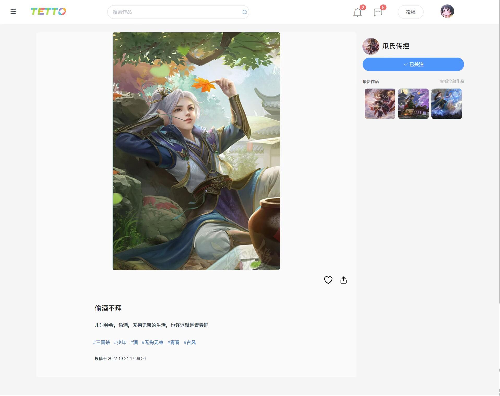
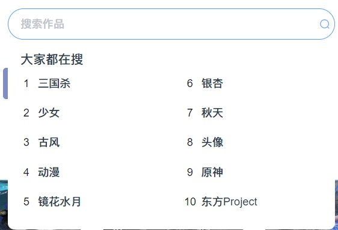
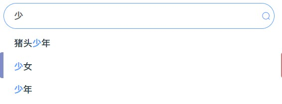
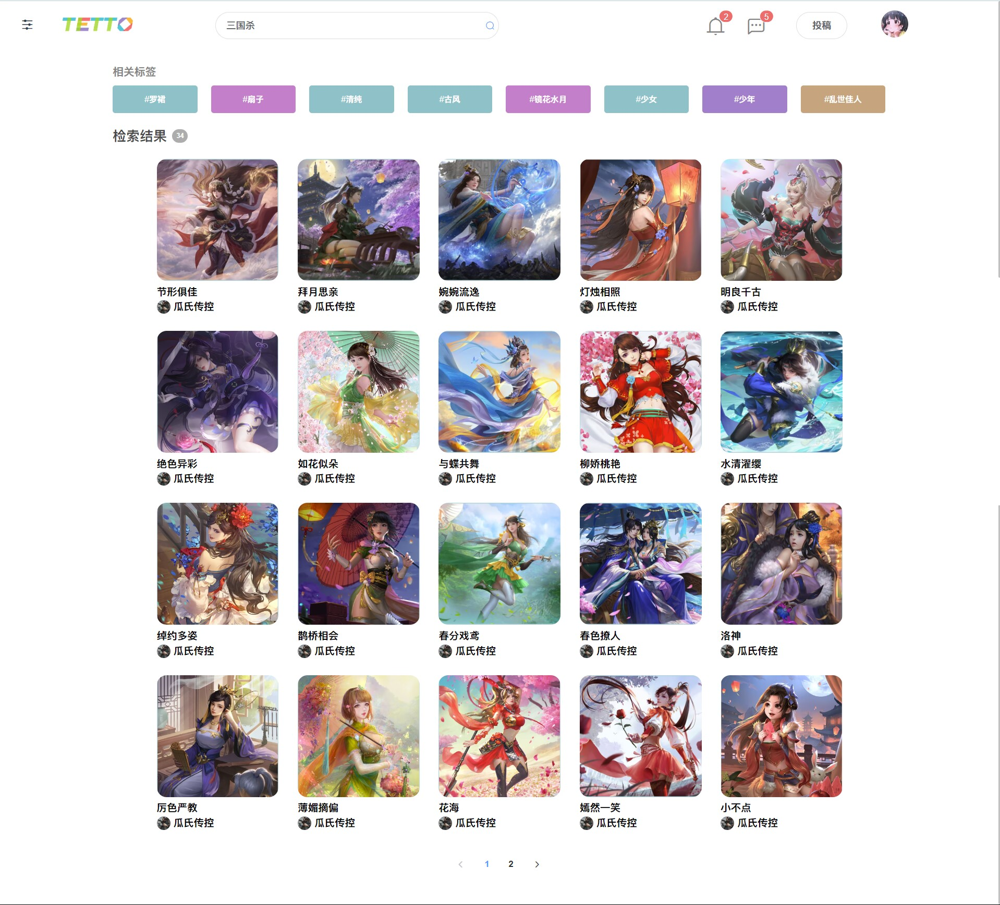
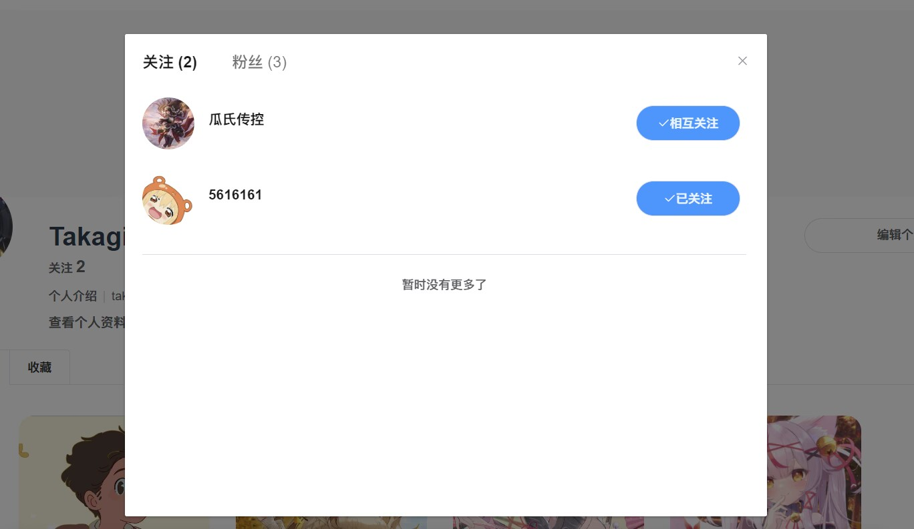
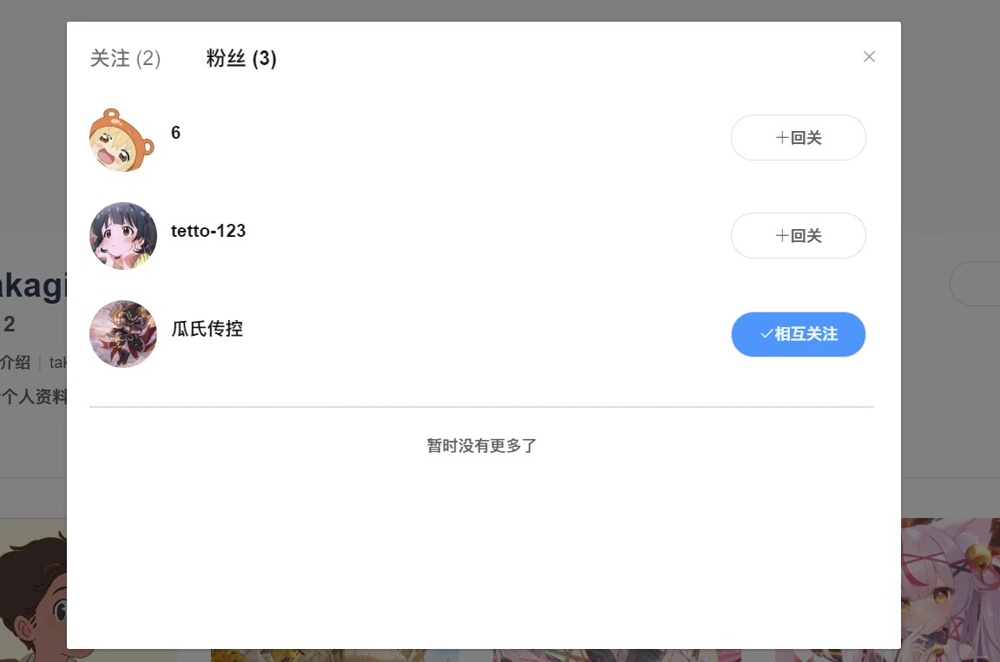
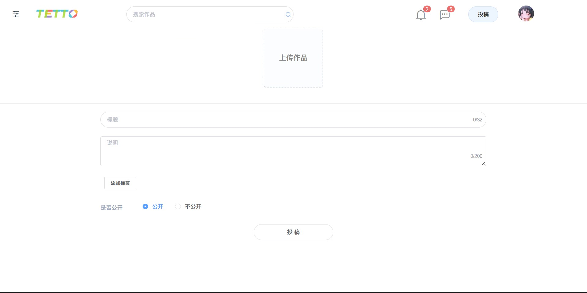
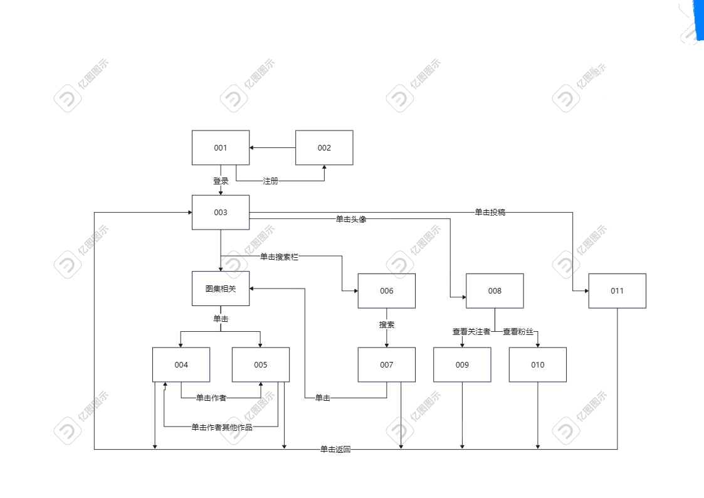
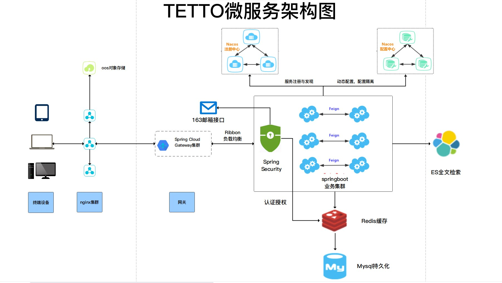

# tetto
> tetto(特图)插画分享平台

前端项目地址：[tetto-web](https://github.com/Elziy/tetto-vue)

## 项目截图












_**界面关系图**_


## 项目目录

```
tetto 
├── tetto-admin           // 管理员模块(未实现)
├── tetto-gateway         // 网关模块 
├── tetto-auth            // 认证中心
├── tetto-common          // 通用模块
├── tetto-generator       // 代码生成模块(不需要运行)
├── tetto-image           // 图集模块
├── tetto-recommend       // 推荐模块
├── tetto-search          // 检索模块
├── tetto-upload          // 文件上传模块
├──pom.xml                // 公共依赖
```

**_架构图_**


## 运行准备

1. 安装MySQL，创建数据库并执行tetto.sql
2. 安装nacos，并配置各模块中的bootstrap.yaml
3. 安装redis，并配置nacos
4. 安装elasticsearch，并配置nacos
5. 安装maven依赖

## 运行

1. 运行tetto-gateway模块下的Gateway
2. 运行tetto-auth模块下的Auth
3. 运行tetto-image模块下的Image
4. 运行tetto-recommend模块下的Recommend
5. 运行tetto-search模块下的Search
6. 运行tetto-upload模块下的Upload到static.tetto.com:90

